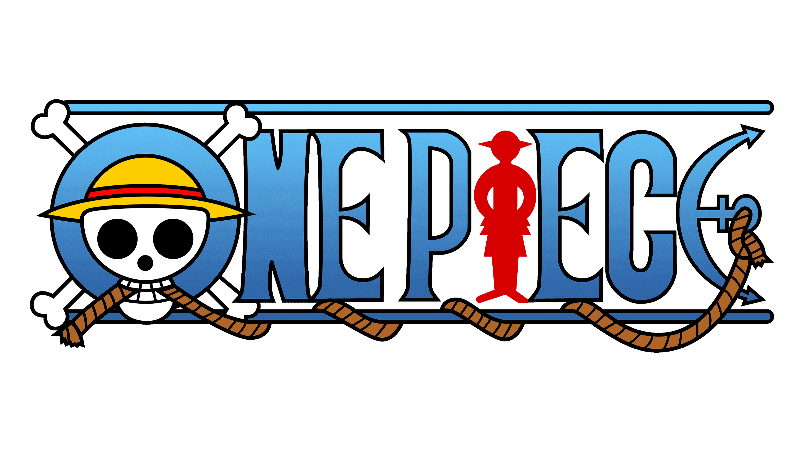
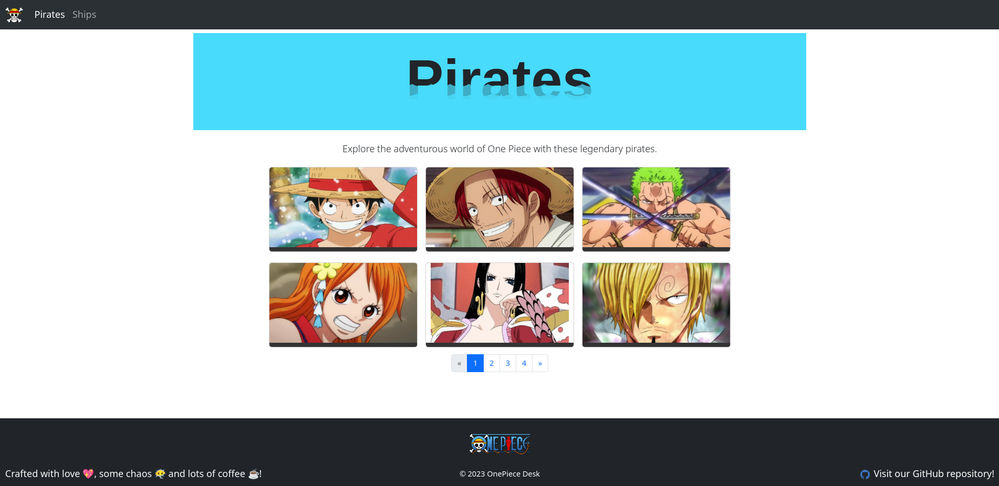

# OnePiece Desk

**_One Piece Desk_** is a comprehensive and interactive web application dedicated to the legendary world of _One Piece_, a popular manga and anime series created by Eiichiro Oda. This GitHub repository serves as the codebase for the _One Piece Desk_ project, offering fans and enthusiasts a dynamic platform to explore, learn, and engage with the rich and adventurous universe of _One Piece_.

# Table of content

- [OnePiece Desk](#onepiece)
  - [Screenshots](#screenshots)
  - [Demo](#demo)
  - [Tech Stack](#tech-stack)
  - [Installation](#installation)
    - [Development server](#development-server)
    - [Code scaffolding](#code-scaffolding)
    - [Build](#build)
    - [Further help](#further-help)
  - [Feedback](#feedback)
  - [License](#license)
  - [Authors](#authors)

## Screenshots

## Demo

Link to demo [https://onepiecedesk.netlify.app](https://onepiecedesk.netlify.app)

## Tech Stack

**Angular version** 16.2.0

**Angular cli version:** 16.2.3

**Node version:** 18.12.1

**NPM version:** 8.19.2

## Installation

This project was generated with [Angular CLI](https://github.com/angular/angular-cli) version 16.2.3.

`git clone https://github.com/christophermontero/onepiecedesk.git`

`cd onepiecedesk`

### Development server

Run `ng serve` for a dev server. Navigate to `http://localhost:4200/`. The application will automatically reload if you change any of the source files.

### Code scaffolding

Run `ng generate component component-name` to generate a new component. You can also use `ng generate directive|pipe|service|class|guard|interface|enum|module`.

### Build

Run `ng build` to build the project. The build artifacts will be stored in the `dist/` directory.

### Further help

To get more help on the Angular CLI use `ng help` or go check out the [Angular CLI Overview and Command Reference](https://angular.io/cli) page.

## Feedback

If you have any feedback, please reach out at cgortizm21@gmail.com

## License

[MIT](https://choosealicense.com/licenses/mit/)

## Authors

- [@christophermontero](https://github.com/christophermontero)
